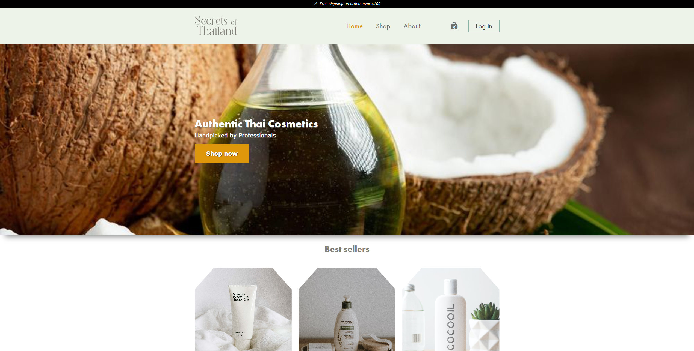

# Secrets of Thailand

## Description

Secrets of Thailand is a e-Commerce site where users can browse through thai cosmetics and add cosmetics to a shopping cart.
The project has a visitor side for users searching for cosmetics, as well as an administration side where the page owner can add/delete/edit products.

The project is setup with a rest API on Strapi where the products and hero image are stored.

- Visitor side
- Admin side
- Strapi rest API

## Built With

- Javascript
- SCSS
- Bootstrap
- Strapi

## Getting Started

### Installing

1. Clone the repo:
   `git clone https://github.com/glennlarsen/semesterproject2.git`
   Clones the repo to your choosen destination.

### Running

Install the visual studio code plugin `Live server` and run the project by right clicking the index file and choose `Open with live server`

### Strapi server

The strapi server is hosted locally. To run the strapi server clone this repo with this command\
` git clone https://github.com/glennlarsen/strapi-semester-project2.git`

`npm install` to install all dependencies.

`npm run develop` to start the strapi server on localhost.

### Live Site

The website is deployed on netlify.
[Link to live site](https://dreamy-swanson-ccd702.netlify.app/)

## Contributing

Contributions to the project are very much appreaciated. To contribute please open a pull request so the code can be reviewed.

## Contact

[My LinkedIn Page](https://www.linkedin.com/in/glenn-larsen-288173242/)\
[My Portfolio](https://glennportfolio.site)
